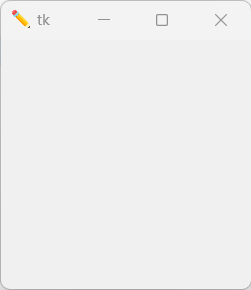
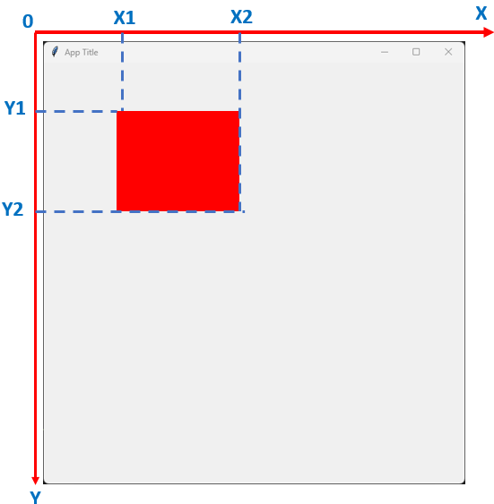

## TKINTER NOTE

### Tkinter Window Properties
- `Display Window`:
```python
import tkinter as tk
window = tk.Tk()
window.mainloop()
```
- `Window Title`:
```python
import tkinter as tk
window = tk.Tk()
# Window title
window.title('Your title here)
window.mainloop()
```
- `Window Size`:
```python
import tkinter as tk
window = tk.Tk()
# Window size
window.geometry("300x500")
window.mainloop()
```
- `Full Screen`:
```python
import tkinter as tk
window = tk.Tk()
# Full Screen option
window.attributes('-fullscreen'. True)
window.mainloop()
```
- `Background`
```python
import tkinter as tk
window = tk.Tk()
# Change the background color here
window.configure(bg="blue")
window.mainloop()
```
- `Disable Resizable Window`
```python
import tkinter as tk
window = tk.Tk()
# resizable
window.resizable(0, 0) # or window.resizable(False, False)
window.mainloop()
```
- `Window Icons`

```python
from tkinter import *
window = Tk()
# Icons
icon = PhotoImage(file="icon.png")
window.iconphoto(False,icon)

window.mainloop()
```


### Tkinter frame container properties
- `Frame declaration`.

```python
import tkinter as tk
window = tk.Tk()
window.geometry("300x300")

# Frame declaration
frame = tk.Frame(window)
frame.pack()
window.mainloop()
```
- `Frame Width and Height`

```python
import tkinter as tk
window = tk.Tk()
window.geometry("300x300")

# Frame width and height
frame = tk.Frame(window, width=300, height=300)
frame.pack()
window.mainloop()
```
- `Frame background color`

```python
import tkinter as tk
window = tk.Tk()
window.geometry("300x300")

# Frame background color
frame = tk.Frame(window, width=300, height=300, bg="red")
frame.pack()
window.mainloop()
```
### Canvas widget properties
- `Canvas declaration`

```python
import tkinter as tk
window = tk.Tk()
window.geometry("300x300")

# Frame
frame = tk.Frame(window, width=300, height=300)
frame.pack()

# Canvas declaration
canvas = tk.Canvas(frame)
canvas.pack()
window.mainloop()
```
- `Canvas width and height`

```python
import tkinter as tk
window = tk.Tk()
window.geometry("300x300")

# Frame
frame = tk.Frame(window, width=300, height=300)
frame.pack()

# Canvas width and height
canvas = tk.Canvas(frame, width=200, height=200)
canvas.pack()
window.mainloop()
```
- `Canvas Background color`

```python
import tkinter as tk
window = tk.Tk()
window.geometry("300x300")

# Frame
frame = tk.Frame(window, width=300, height=300)
frame.pack()

# Canvas background color
canvas = tk.Canvas(frame, width=200, height=200, bg="blue")
canvas.pack()
window.mainloop()
```
### Canvas shape sample


- `Rectangle Shape`

```python
import tkinter as tk
window = tk.Tk()
window.geometry("300x300")

# Frame
frame = tk.Frame(window, width=300, height=300)
frame.pack()

# Canvas 
canvas = tk.Canvas(frame, width=200, height=200)
canvas.pack()

# shape (fill is optional)
canvas.create_rectangle(10, 10, 100, 100, fill="red")
window.mainloop()
```
- `Circle Shape`

```python
import tkinter as tk
window = tk.Tk()
window.geometry("300x300")

# Frame
frame = tk.Frame(window, width=300, height=300)
frame.pack()

# Canvas 
canvas = tk.Canvas(frame, width=200, height=200)
canvas.pack()

# shape (fill is optional)
canvas.create_oval(10, 10, 100, 100, fill="red")
window.mainloop()
```
- `Text`

```python
import tkinter as tk
window = tk.Tk()
window.geometry("300x300")

# Frame
frame = tk.Frame(window, width=300, height=300)
frame.pack()

# Canvas 
canvas = tk.Canvas(frame, width=200, height=200)
canvas.pack()

# text (fill, font are optional)
canvas.create_text(10, 100, text="hello", fill="red", font=("bold", 30))
window.mainloop()
```
